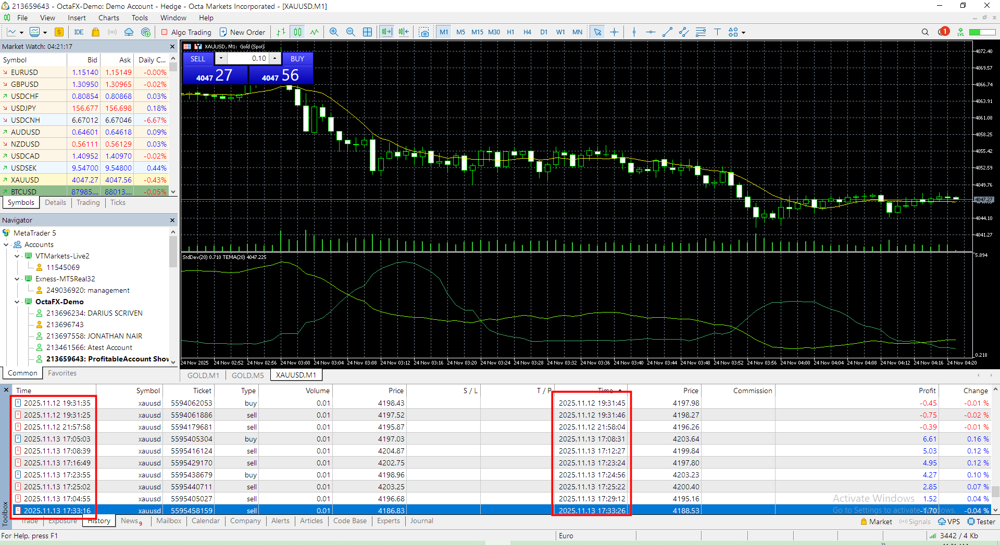
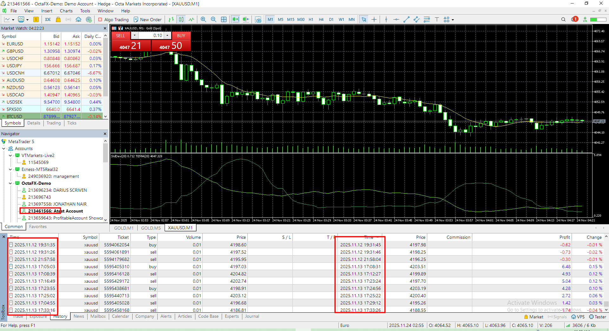
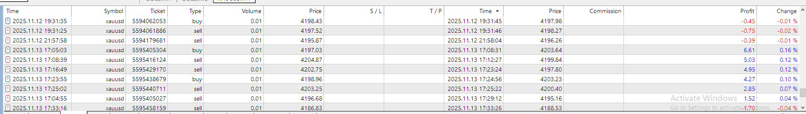
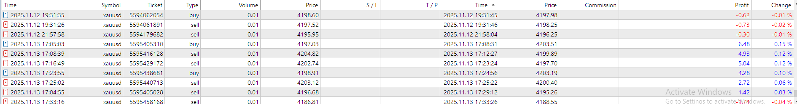
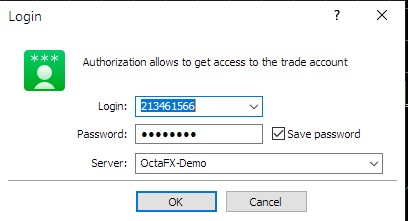

# Copytrading Bot & Platform

Professional-grade copytrading infrastructure engineered for MT4, MT5, cTrader, Tradovate, IBKR, and other leading broker APIs—designed for seamless, real-time trade replication across accounts, brokers, and asset classes.

## Latency Analysis

| MT5 Target History | MT5 Copy History |
| --- | --- |
|  |  |
|  |  |

> Screens show MT5-to-MT5 mirroring; the same copy engine powers MT4↔MT5, MT5↔cTrader, MT4↔Tradovate, MT5↔IBKR, and other cross-broker routes.

## What the Platform Delivers
- **True cross-terminal replication**: Copy trades between MT4, MT5, cTrader, Tradovate, IBKR, or any supported API in any direction (e.g., MT5→MT4, MT5→cTrader, MT4→IBKR).
- **Unified signal ingestion**: A single automation layer can scrape Telegram groups/channels or ingest provider APIs, trigger execution instantly, and relay the same signals via Telegram, Discord, WhatsApp, or email alerts.
- **Ultra-low latency**: Co-located trade bridges, streaming sockets, and smart batching keep master-to-slave execution within 100–500 ms even across mixed broker stacks.
- **Master/Slave orchestration**: Define master accounts, manage unlimited slave accounts, and synchronize positions, risk parameters, and lot multipliers in milliseconds.
- **Flexible monetization**: Support subscription fees, performance fees, or profit-sharing automatically credited to service providers and master traders.
- **Enterprise reliability**: Auto-retry execution, latency monitoring, smart order routing, and robust logging for audit-ready transparency.

## Credentials Required for MT4/MT5 Connections
To connect any MetaTrader account, users simply supply the details shown below:
- Login (account number)
- Password (trading or investor as required)
- Broker/server name (exact server string from the trading platform)

## Service Models I Can Deliver

**1. For Copytrading Service Providers**
- I build custom bots or end-to-end platforms where users register, onboard their accounts, and start copying immediately.
- Providers can onboard profitable masters, let other traders join as slaves, and automatically charge platform fees, master performance fees, or profit-sharing.
- I can also configure one-to-many setups where the provider keeps full control of master accounts while retail users connect as slaves.

**2. For Traders Seeking Passive Profits**
- I operate live, profitable MT5 accounts on major forex symbols and can connect directly to your MT4, MT5, cTrader, Tradovate, or IBKR account once you share your credentials.
- You earn through a transparent profit-sharing plus connection fee model—no need to manage strategies, signals, or execution.

Reach out to discuss your copytrading vision, and I’ll build or connect the exact solution you need.

---

**Contact**
-  [@AlwaysYouRock](https://t.me/AlwaysYouRock)
-  [+380965624237](https://wa.me/380965624237)
-  cutting.edge.1010101@gmail.com
-  [alwaysyourock](https://discord.com/users/alwaysyourock)
